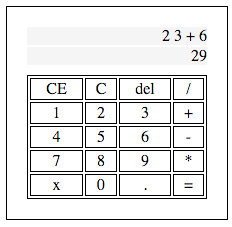

Javascript Calculator
===============

The aim of this project is to create a simple calculator application in Javascript. Initially it will be able to carry out addition, subtraction, multiplication & division.

Installation
=========

1. Clone this repo locally
2. Change into calculator folder
3. Run 'open Calculator.html'
4. Use calculator as normal

Additions
=======
Eventually it will include additional functions such as squares, square roots, trigonometric functions, logarithmic functions & pi.

Created by [James Borrell](https://github.com/JBorrell)
